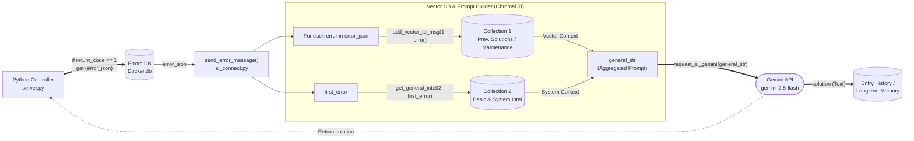

## AI-Anbindung & RAG-Pipeline (`ai_connect.py`)

```mermaid
flowchart LR
    Controller["Python Controller<br/>server.py"] ==>|"if return_code == 1<br/>get {error_json}"| ErrDB[("Errors DB<br/>Docker.db")]
    ErrDB -->|"error_json"| SendFn["send_error_message()<br/>ai_connect.py"]

    subgraph RAG ["Vector DB & Prompt Builder (ChromaDB)"]
        direction TB
        Loop["For each error in error_json"] -->|"add_vector_to_msg(1, error)"| Col1[("Collection 1<br/>Prev. Solutions / Maintenance")]
        Col1 -->|"Vector Context"| Prompt["general_str<br/>(Aggregated Prompt)"]
        FirstErr["first_error"] -->|"get_general_intel(2, first_error)"| Col2[("Collection 2<br/>Basic & System Intel")]
        Col2 -->|"System Context"| Prompt
    end

    SendFn --> Loop
    SendFn --> FirstErr

    Prompt ==>|"request_ai_gemini(general_str)"| Gemini(["Gemini API<br/>gemini-2.5-flash"])
    Gemini ==>|"solution (Text)"| History[("Entry History /<br/>Longterm Memory")]
    Gemini -.->|"Return solution"| Controller
```